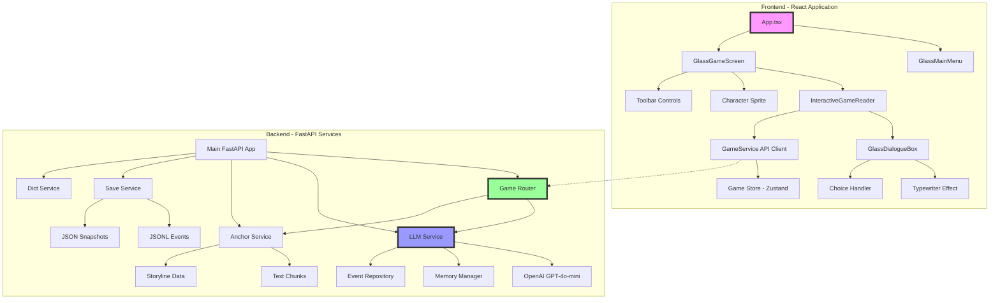
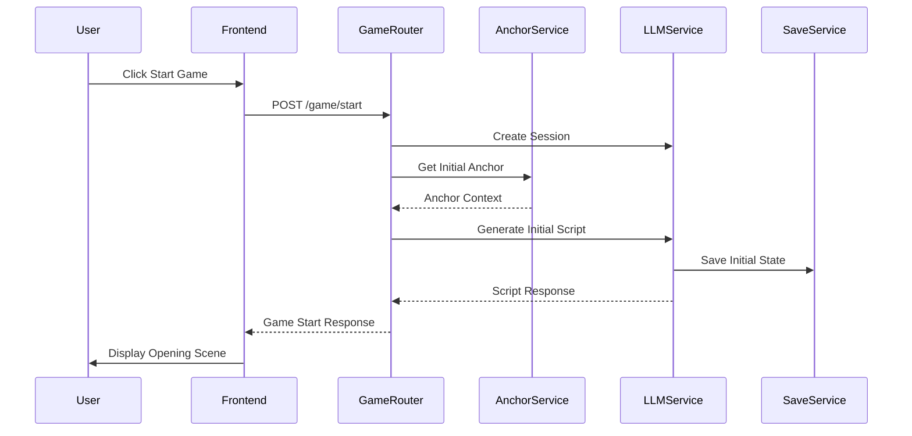
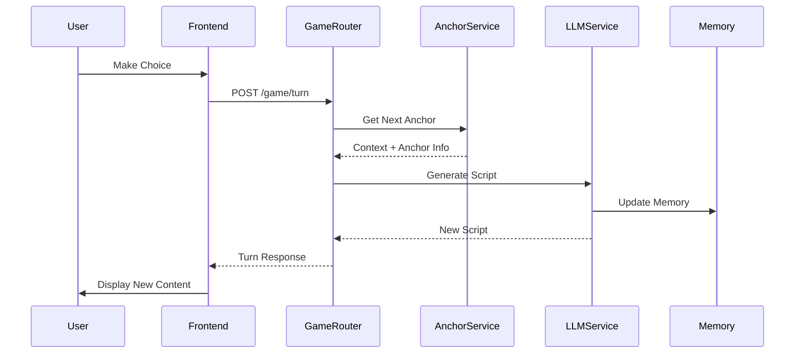

# WhatIf Component Architecture

## System Architecture Diagram



## Component Hierarchy

### Frontend Components

```
App.tsx
├── GlassMainMenu
│   ├── GlassCard
│   ├── GlassButton
│   └── Menu Options
│       ├── Start Game
│       ├── Interactive Mode
│       ├── Anchor Demo
│       └── API Test
│
├── GlassGameScreen
│   ├── Toolbar
│   │   ├── Back Button
│   │   ├── Play/Pause
│   │   ├── Skip Controls
│   │   ├── Backlog
│   │   ├── Volume
│   │   └── Settings
│   │
│   ├── Character Display
│   │   └── Hero Image
│   │
│   ├── InteractiveGameReader
│   │   ├── GameInitializer
│   │   ├── GameDisplay
│   │   │   ├── Script Renderer
│   │   │   └── Loading States
│   │   │
│   │   └── GlassDialogueBox
│   │       ├── Speaker Display
│   │       ├── Typewriter Text
│   │       ├── Choice Buttons
│   │       └── Auto/Skip Controls
│   │
│   ├── Backlog Panel
│   └── Settings Panel
│
└── UI Components
    ├── GlassCard
    ├── GlassButton
    ├── SimpleGlass
    └── AdvancedGlass
```

### Backend Services

```
FastAPI Application
├── Core
│   ├── Config
│   ├── Middleware
│   └── Utils
│
├── Game Router (/api/v1/game)
│   ├── /start
│   ├── /turn
│   ├── /sessions/{id}/status
│   └── /health
│
├── LLM Service (/api/v1/llm)
│   ├── Services
│   │   ├── Script Generation
│   │   ├── Session Management
│   │   └── Memory Integration
│   │
│   ├── Repositories
│   │   ├── OpenAI Client
│   │   ├── Event Stream
│   │   └── Snapshot Storage
│   │
│   └── Memory Manager
│       ├── Short-term Memory
│       ├── Long-term Memory
│       └── FAISS Vector Store
│
├── Anchor Service (/api/v1/anchor)
│   ├── Context Builder
│   ├── Chunk Repository
│   └── Storyline Navigator
│
├── Save Service (/api/v1/save)
│   ├── Snapshot Manager
│   ├── Event Stream
│   └── File Operations
│
└── Dict Service (/api/v1/dict)
    ├── Dictionary Loader
    └── Segment Retrieval
```

## Data Flow Sequences

### Game Start Sequence



### Player Turn Sequence



## State Management

### Frontend State (Zustand)

```typescript
interface GameStore {
  // Session State
  sessionId: string | null
  isLoading: boolean
  error: string | null
  
  // Game State
  currentChapter: number
  currentAnchor: number
  currentAnchorId: string | null
  
  // Script State
  scriptUnits: ScriptUnit[]
  currentUnitIndex: number
  
  // Player State
  playerChoices: PlayerChoice[]
  globalState: GlobalState
  
  // Actions
  initializeGame: (protagonist: string) => Promise<void>
  makeChoice: (choice: string) => Promise<void>
  updateGameState: (state: Partial<GameState>) => void
  reset: () => void
}
```

### Backend State (Memory Manager)

```python
class MemoryManager:
    def __init__(self):
        self.short_term_memory = []  # Last 20 events
        self.long_term_memory = {}   # Persistent storage
        self.vector_store = None     # FAISS index
        
    async def add_memory(self, event: TurnEvent):
        # Add to short-term
        # Extract key information
        # Update long-term if significant
        # Update vector embeddings
        
    async def get_relevant_memories(self, query: str):
        # Semantic search
        # Combine short and long term
        # Return ranked results
```

## Component Interactions

### UI Component Communication

```
GlassGameScreen
    ↓ props
InteractiveGameReader
    ↓ context
GlassDialogueBox
    ↑ callbacks
GameService
    ↔ HTTP
Backend APIs
```

### Service Communication

```
Game Router (Orchestrator)
    ├→ Anchor Service (Context)
    ├→ LLM Service (Generation)
    │   ├→ Memory Manager
    │   └→ OpenAI API
    └→ Save Service (Persistence)
```

## Glass Morphism UI System

### Component Hierarchy

```
GlassCard (Base Container)
├── backdrop-blur effect
├── border styling
├── opacity control
└── animation variants

GlassButton (Interactive)
├── hover states
├── click animations
├── variant styles
└── size options

GlassDialogueBox (Game UI)
├── GlassCard base
├── speaker section
├── content area
├── choice buttons
└── control panel
```

### Styling Architecture

```css
/* Glass Effect Base */
.glass-base {
  backdrop-filter: blur(12px);
  background: rgba(255, 255, 255, 0.1);
  border: 1px solid rgba(255, 255, 255, 0.2);
  border-radius: 16px;
}

/* Variants */
.glass-card { /* Container styling */ }
.glass-button { /* Interactive styling */ }
.glass-dialogue { /* Game UI styling */ }
```

## Performance Optimizations

### Frontend
- React.memo for expensive components
- useMemo for computed values
- Lazy loading for routes
- Debounced API calls
- Virtual scrolling for long content

### Backend
- Async/await throughout
- Connection pooling
- Response caching
- Batch processing
- Background tasks for memory

---

*This component diagram represents the WhatIf architecture as of version 0.1.0*