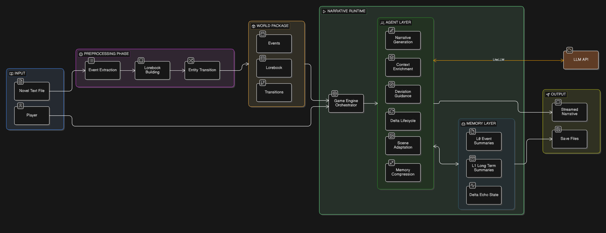
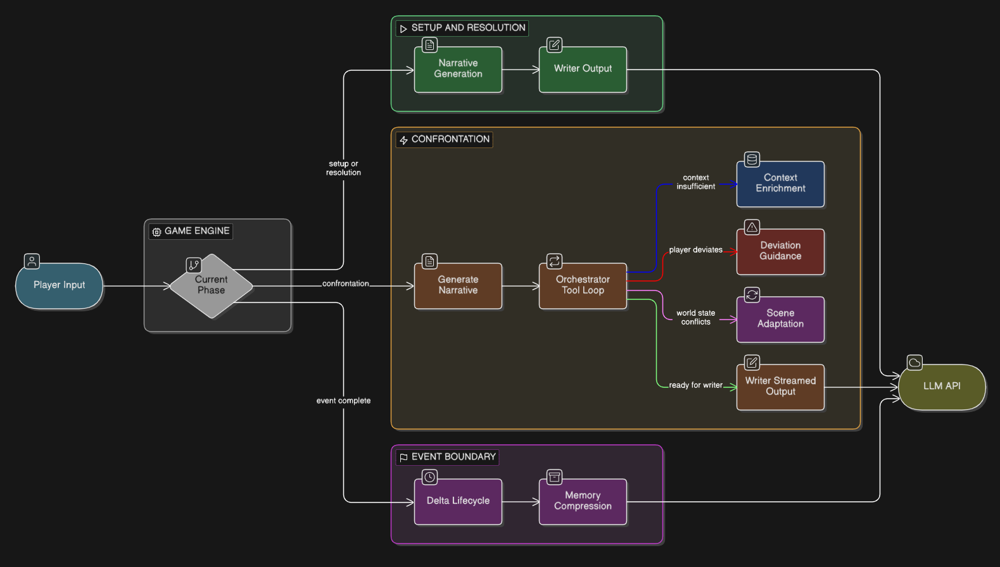

# WhatIf - 互动式小说引擎

<p align="center">
  <strong>把小说变成你可以亲自改写的 AI 叙事游戏</strong><br>
  <sub>输入一本中文小说，提取结构化世界数据，然后以玩家身份进入同一世界。你的每个选择都会改写剧情走向。</sub>
</p>

<p align="center">
  <a href="LICENSE"></a>
  <a href="https://www.python.org/"></a>
  <a href="https://react.dev/"></a>
  <a href="https://fastapi.tiangolo.com/"></a>
</p>

> ⚠️ **Alpha 阶段**：核心功能可用，但 API 与数据格式仍可能调整。欢迎试用和反馈。

---

## 你可以用 WhatIf 做什么

- 从 `.txt` 小说自动提取事件、角色、地点、物品、知识体系
- 自动分析实体在事件间的状态变化（Entity Transitions）
- 用 CLI 或网页端游玩，在互动中偏离原著并保持叙事连贯
- 存档 / 读档，支持长线体验，此系统还在测试中
- 导出会话日志，并用可视化工具分析 LLM 调用与 Agent 执行

---

## 快速开始

### 1. 安装依赖

```bash
git clone https://github.com/ypcypc/WhatIf.git
cd WhatIf

python -m venv .venv
# Windows PowerShell
.\.venv\Scripts\Activate.ps1
# macOS / Linux
# source .venv/bin/activate

pip install -r backend/requirements.txt
python -m spacy download zh_core_web_sm
```

网页端依赖：

```bash
cd frontend
pnpm install
cd ..
```
如没有网页端需求可以选择不安装。

### 2. 配置 API Key

```bash
cp backend/.env.example backend/.env
```

编辑 `backend/.env`，填写你在 `backend/llm_config.yaml` 中实际使用到的 Key：

```env
DASHSCOPE_API_KEY=your_key_here
# 或 GEMINI_API_KEY / OPENAI_API_KEY / ANTHROPIC_API_KEY / STEPFUN_API_KEY / XAI_API_KEY / VOLCENGINE_API_KEY
```

建议：在 `llm_config.yaml` 每个条目里显式填写 `api_key_env`，避免依赖前缀推断。

### 3. 提取世界数据

```bash
cd backend
python extract.py ../data/novels/我的小说.txt ../output/我的小说
```

### 4. 开始游玩

CLI:

```bash
cd backend
python play.py ../output/我的小说
```

网页端：

```bash
cd ..
python start.py
# 打开 http://localhost:5173
```

说明：网页端默认读取 `backend/config.py` 中 `OUTPUT_BASE` 指向的 WorldPkg。

---

## 架构概览

WhatIf 分两阶段工作：

第一阶段：
小说 `.txt` -> 文本清理与分句 -> 事件提取 -> Lorebook 提取 -> 实体状态转换 -> WorldPkg

第二阶段：  
WorldPkg -> GameEngine -> FastAPI + SSE -> 网页端 / CLI

<p align="center">
  
</p>

<details>
<summary><b>Agents Framework, 点击展开</b></summary>

<br>

第二阶段的 6 个 Agent 分别负责叙事生成、上下文召回、偏离引导、替代时间线管理、场景适配、记忆压缩。  
它们通过 `AgentExecutor` 注册表协同执行，维持可持续的互动叙事流程。

<p align="center">
  
</p>

</details>

---

## 使用说明

### CLI 命令

| 命令 | 说明 |
| --- | --- |
| `/help` | 查看所有命令 |
| `/save [槽位]` | 保存进度 |
| `/saves` | 列出所有存档 |
| `/status` | 查看当前状态 |
| `/restart` | 重新开始 |
| `/quit` | 退出 |

说明：读档通过启动菜单选择，不是 `/load` 命令。
CLI 命令还在测试阶段，可能会有 Bug.

### 网页端手动启动

如果要分别调试后端与前端：

```bash
# 终端 1 - 后端
cd backend
uvicorn api.app:app --reload --port 8000

# 终端 2 - 前端
cd frontend
pnpm dev --port 5173
```

### WorldPkg 输出结构

```text
output/<作品名>/
├── metadata.json
├── source/
│   ├── full_text.txt
│   └── sentences.json
├── events/
│   └── events.json
├── lorebook/
│   ├── characters.json
│   ├── locations.json
│   ├── items.json
│   └── knowledge.json
├── transitions/
│   └── transitions.json
└── debug/
```

---

## LLM 配置

LLM 相关配置在 `backend/llm_config.yaml`。  
系统路径、日志等运行配置在 `backend/config.py`。

### llm_config.yaml 字段

| 字段 | 说明 |
| --- | --- |
| `model` | LiteLLM 模型名（例如 `dashscope/qwen3.5-plus`） |
| `temperature` | 温度，默认 `0.2` |
| `thinking_budget` | 推理预算（仅在 `extra_params` 为空时参与自动翻译） |
| `extra_params` | 直接透传给 LiteLLM；有值时跳过自动翻译 |
| `api_base` | 可选，自定义 Provider 端点 |
| `api_key_env` | 可选，显式指定读取哪个环境变量作为 API Key |

约束：`extra_params` 不能覆盖保留键 `model/messages/temperature/stream/response_format/max_tokens`。

### 自定义 LLM 服务商（模板）

最小模板（给不同 Agent/Extractor 分别配置）：

```yaml
extractors:
  event_extractor:
    model: dashscope/qwen3.5-plus
    temperature: 0.2
    thinking_budget: 3000
    api_key_env: DASHSCOPE_API_KEY

agents:
  setup_orchestrator:
    model: anthropic/claude-sonnet-4-20250514
    temperature: 0.3
    thinking_budget: 256
    api_key_env: ANTHROPIC_API_KEY
```

高级模板（Provider 原生参数）：

```yaml
extractors:
  event_extractor:
    model: volcengine/doubao-seed-2-0-pro
    api_key_env: VOLCENGINE_API_KEY
    extra_params:
      extra_body:
        reasoning_effort: hi
```

OpenAI-compatible 自定义端点（例如第三方网关）：

```yaml
agents:
  unified_writer:
    model: openai/step-2-16k
    api_base: https://api.stepfun.com/v1
    api_key_env: STEPFUN_API_KEY
    extra_params:
      reasoning_effort: high
```

当前自动翻译规则（仅在 `extra_params` 为空时生效）：

- `dashscope/*`：生成 `extra_body.enable_thinking`（并按需附带 `thinking_budget`）
- `anthropic/*`：生成 `thinking: { type: enabled, budget_tokens }`
- 其他前缀：生成 `reasoning_effort: low/medium/high`

### 当前支持自动匹配的服务商

| model 前缀 | 默认参数路径（`extra_params` 为空时） | 默认 API Key 环境变量 |
| --- | --- | --- |
| `dashscope/*` | `extra_body.enable_thinking` + `thinking_budget` | `DASHSCOPE_API_KEY` |
| `anthropic/*` | `thinking: { type, budget_tokens }` | `ANTHROPIC_API_KEY` |
| `openai/*` | `reasoning_effort` | `OPENAI_API_KEY` |
| `gemini/*` | `reasoning_effort` | `GEMINI_API_KEY` |
| `volcengine/*` | `reasoning_effort` | `VOLCENGINE_API_KEY` |

说明：
- 以上“默认 API Key 环境变量”来自启动校验映射。
- `stepfun`、`xai` 或其他前缀同样可用，但建议显式填写 `api_key_env`（必要时再配 `api_base`）。
- 如果某服务商对推理参数格式有特殊要求，优先在 `extra_params` 写原生参数覆盖默认翻译。

### 如何新增 LLM 服务商

1. 在 `backend/llm_config.yaml` 为目标 Agent / Extractor 改 `model`。  
2. 为该条目填写 `api_key_env`，推荐显式指定 API, 如 `ANTHROPIC_API_KEY`, 若该条目留空，则程序会尝试匹配合适的 API KEY.
3. 如果默认参数转译不适配该服务商，在 `extra_params` 写原生参数。  
4. 在 `backend/.env` 增加对应 API Key。  
5. 启动前运行一次校验：

```bash
cd backend
python -c "import config; print('llm config ok')"
```

---

## API 端点

| 方法 | 端点 | 说明 |
| --- | --- | --- |
| GET | `/api/health` | 健康检查 |
| POST | `/api/game/start` | 开始游戏（SSE 流式） |
| POST | `/api/game/action` | 玩家行动（SSE 流式） |
| POST | `/api/game/continue` | 继续推进（SSE 流式） |
| GET | `/api/game/state` | 查询当前状态 |
| POST | `/api/game/save` | 存档 |
| GET | `/api/game/saves` | 列出存档 |
| POST | `/api/game/load` | 读档 |

---

## 日志与分析

- 会话日志：`logs/sessions/*.jsonl`
- 可视化分析：用浏览器打开 `tools/log_analyzer.html`，拖入 `.jsonl` 文件查看统计与时间线

---

## 常见问题

- **报错 `XXX_API_KEY 未设置`**：检查 `backend/.env` 是否已填写，并重开终端。
- **报错缺少 `zh_core_web_sm`**：运行 `python -m spacy download zh_core_web_sm`。
- **网页端无法开始游戏**：通常是 `OUTPUT_BASE` 目录不存在。请先确认 WorldPkg 已生成。
- **报错 `llm_config.yaml 缺少必需配置/存在未知配置键`**：检查配置键名是否与系统要求一致。
- **报错 `extra_params 不允许覆盖保留键`**：移除 `extra_params` 中对 `model/messages/temperature/stream/response_format/max_tokens` 的覆盖。

---

## Roadmap

### 近期

- [ ] 语音互动：语音输入 + 叙事朗读
- [ ] Prompt 优化与 Token 消耗优化

---

## 贡献

欢迎提交 Issue 和 PR，详见 [docs/CONTRIBUTING.md](docs/CONTRIBUTING.md)。

---

## 随便聊聊
如果您关于这个项目有什么好的想法或者点子，随时欢迎写邮件至 ypc1956280693@gmail.com 聊聊 :)

---

## 许可证

[MIT License](LICENSE)
