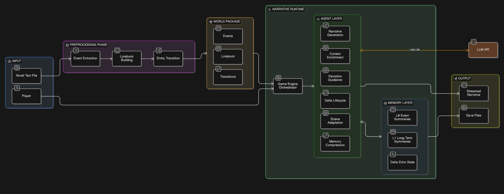
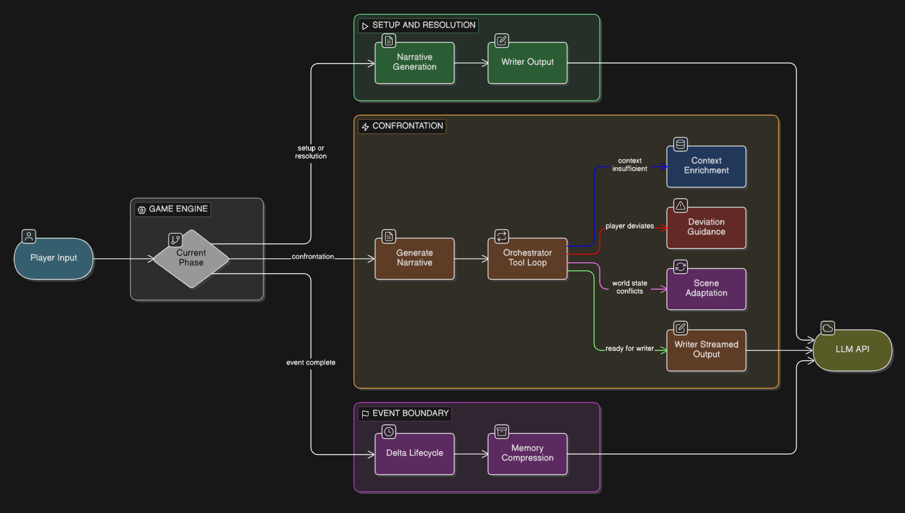

# WhatIf - 互动式小说引擎 / Interactive Fiction Engine

<p align="center">
  <strong>把小说变成你可以亲自改写的 AI 叙事游戏</strong><br>
  <strong>Turn a novel into an AI-powered narrative game that you can rewrite yourself</strong><br>
  <sub>输入一本中文小说，提取结构化世界数据，然后以玩家身份进入同一世界。你的每个选择都会改写剧情走向。</sub><br>
  <sub>Provide a Chinese novel, extract structured world data, and then enter that same world as a player. Every choice you make can reshape the storyline.</sub>
</p>

<p align="center">
  <a href="LICENSE"></a>
  <a href="https://www.python.org/"></a>
  <a href="https://react.dev/"></a>
  <a href="https://fastapi.tiangolo.com/"></a>
</p>

> ⚠️ **Alpha 阶段 / Alpha Stage**：核心功能已经可用，但 API 与数据格式仍可能调整。欢迎试用并反馈问题与建议。  
> The core features are available, but APIs and data formats may still change. Testing, feedback, and suggestions are welcome.

---

## 你可以用 WhatIf 做什么 / What You Can Do with WhatIf

- 从 `.txt` 小说自动提取事件、角色、地点、物品和知识体系。  
  Automatically extract events, characters, locations, items, and knowledge systems from `.txt` novels.
- 自动分析实体在事件之间的状态变化（Entity Transitions）。  
  Automatically analyze entity state changes across events, also known as Entity Transitions.
- 使用 CLI 或网页端游玩，在互动中偏离原著，同时保持叙事连贯。  
  Play through the CLI or web interface, diverge from the original story during interaction, and keep the narrative coherent.
- 支持存档 / 读档，适合长线体验；该系统仍在测试中。  
  Save and load progress for long-form play sessions. This system is still under testing.
- 导出会话日志，并通过可视化工具分析 LLM 调用与 Agent 执行情况。  
  Export session logs and analyze LLM calls and Agent execution through the visualization tool.

---

## 下载体验 / Download and Try

如果你只想体验 WhatIf，而不需要自行搭建开发环境，建议直接下载已经打包好的桌面版：  
If you only want to try WhatIf without setting up a development environment, downloading the packaged desktop version is recommended:

1. 前往 [Releases](https://github.com/ypcypc/WhatIf/releases) 页面。  
   Go to the [Releases](https://github.com/ypcypc/WhatIf/releases) page.
2. 下载最新版本的安装包，或下载免安装版。  
   Download the latest installer or the portable version.
3. 运行后，在设置页面填入你的 API Key，导入数据包即可开始游玩。  
   After launching the app, enter your API Key on the settings page, import a data package, and start playing.

---

## 快速开始（开发者）/ Quick Start for Developers

### 1. 安装依赖 / Install Dependencies

```bash
git clone https://github.com/ypcypc/WhatIf.git
cd WhatIf

python -m venv .venv
# Windows PowerShell
.\.venv\Scripts\Activate.ps1
# macOS / Linux
# source .venv/bin/activate

pip install -r backend/requirements.txt
python -m spacy download zh_core_web_sm
```

网页端依赖：  
Frontend dependencies:

```bash
cd frontend
pnpm install
cd ..
```

如没有网页端需求，可以选择不安装。  
You may skip this step if you do not need the web interface.

### 2. 配置 API Key / Configure API Keys

```bash
cp backend/.env.example backend/.env
```

编辑 `backend/.env`，填写你在 `backend/llm_config.yaml` 中实际使用到的 Key：  
Edit `backend/.env` and add the keys that are actually used in `backend/llm_config.yaml`:

```env
DASHSCOPE_API_KEY=your_key_here
# 或 GEMINI_API_KEY / OPENAI_API_KEY / ANTHROPIC_API_KEY / STEPFUN_API_KEY / XAI_API_KEY / VOLCENGINE_API_KEY
# or GEMINI_API_KEY / OPENAI_API_KEY / ANTHROPIC_API_KEY / STEPFUN_API_KEY / XAI_API_KEY / VOLCENGINE_API_KEY
```

建议：在 `llm_config.yaml` 的每个条目中显式填写 `api_key_env`，避免依赖前缀推断。  
Recommendation: explicitly set `api_key_env` for each entry in `llm_config.yaml` to avoid relying on prefix-based inference.

### 3. 提取世界数据 / Extract World Data

```bash
cd backend
python extract.py ../data/novels/我的小说.txt ../output/我的小说
```

### 4. 开始游玩 / Start Playing

CLI:

```bash
cd backend
python play.py ../output/我的小说
```

网页端：  
Web interface:

```bash
cd ..
python start.py
# 打开 http://localhost:3030
# Open http://localhost:3030
```

说明：网页端启动后，在界面中选择或导入 `.wpkg` 数据包即可开始游玩。  
Note: after the web interface starts, select or import a `.wpkg` data package in the UI to start playing.

---

## 架构概览 / Architecture Overview

WhatIf 分两阶段工作：  
WhatIf works in two stages:

第一阶段：  
Stage 1:

```text
小说 .txt -> 文本清理与分句 -> 事件提取 -> Lorebook 提取 -> 实体状态转换 -> WorldPkg
Novel .txt -> Text cleaning and sentence splitting -> Event extraction -> Lorebook extraction -> Entity state transitions -> WorldPkg
```

第二阶段：  
Stage 2:

```text
WorldPkg -> GameEngine -> FastAPI + SSE -> Electron 桌面端 / 网页端 / CLI
WorldPkg -> GameEngine -> FastAPI + SSE -> Electron desktop app / Web interface / CLI
```

<p align="center">
  
</p>

<details>
<summary><b>Agents Framework / Agent 框架，点击展开 / Click to expand</b></summary>

<br>

第二阶段的 6 个 Agent 分别负责叙事生成、上下文召回、偏离引导、替代时间线管理、场景适配和记忆压缩。  
In the second stage, six Agents handle narrative generation, context retrieval, divergence guidance, alternative timeline management, scene adaptation, and memory compression.

它们通过 `AgentExecutor` 注册表协同执行，维持可持续的互动叙事流程。  
They collaborate through the `AgentExecutor` registry to maintain a sustainable interactive narrative flow.

<p align="center">
  
</p>

</details>

---

## 使用说明 / Usage Guide

### CLI 命令 / CLI Commands

| 命令 / Command | 中文说明 | English Description |
| --- | --- | --- |
| `/help` | 查看所有命令 | View all commands |
| `/save [槽位]` | 保存进度 | Save progress to a slot |
| `/saves` | 列出所有存档 | List all save files |
| `/status` | 查看当前状态 | View the current state |
| `/restart` | 重新开始 | Restart the game |
| `/quit` | 退出 | Quit |

说明：读档通过启动菜单选择，不是 `/load` 命令。  
Note: loading a save is done through the startup menu, not through a `/load` command.

CLI 命令仍处于测试阶段，可能会有 Bug。  
CLI commands are still under testing and may contain bugs.

### 网页端手动启动 / Manually Start the Web Interface

如果要分别调试后端与前端：  
If you want to debug the backend and frontend separately:

```bash
# 终端 1 - 后端
# Terminal 1 - Backend
cd backend
uvicorn api.app:app --reload --port 8000

# 终端 2 - 前端
# Terminal 2 - Frontend
cd frontend
pnpm dev --port 3030
```

### WorldPkg 输出结构 / WorldPkg Output Structure

```text
output/<作品名>/
├── metadata.json
├── source/
│   ├── full_text.txt
│   └── sentences.json
├── events/
│   └── events.json
├── lorebook/
│   ├── characters.json
│   ├── locations.json
│   ├── items.json
│   └── knowledge.json
├── transitions/
│   └── transitions.json
└── debug/
```

---

## LLM 配置 / LLM Configuration

LLM 相关配置在 `backend/llm_config.yaml`。  
LLM-related configuration is located in `backend/llm_config.yaml`.

系统路径、日志等运行配置在 `backend/config.py`。  
Runtime configuration such as system paths and logs is located in `backend/config.py`.

### `llm_config.yaml` 字段 / `llm_config.yaml` Fields

| 字段 / Field | 中文说明 | English Description |
| --- | --- | --- |
| `model` | LiteLLM 模型名，例如 `dashscope/qwen3.5-plus` | LiteLLM model name, for example `dashscope/qwen3.5-plus` |
| `temperature` | 温度，默认 `0.2` | Temperature. The default is `0.2` |
| `thinking_budget` | 推理预算；仅在 `extra_params` 为空时参与自动翻译 | Reasoning budget. Used for automatic parameter translation only when `extra_params` is empty |
| `extra_params` | 直接透传给 LiteLLM；有值时跳过自动翻译 | Passed directly to LiteLLM. Automatic translation is skipped when this field has a value |
| `api_base` | 可选，自定义 Provider 端点 | Optional custom Provider endpoint |
| `api_key_env` | 可选，显式指定读取哪个环境变量作为 API Key | Optional. Explicitly specifies which environment variable should be read as the API Key |

约束：`extra_params` 不能覆盖保留键 `model/messages/temperature/stream/response_format/max_tokens`。  
Constraint: `extra_params` must not override the reserved keys `model/messages/temperature/stream/response_format/max_tokens`.

### 自定义 LLM 服务商（模板）/ Custom LLM Providers: Templates

最小模板（给不同 Agent / Extractor 分别配置）：  
Minimal template, configured separately for different Agents and Extractors:

```yaml
extractors:
  event_extractor:
    model: dashscope/qwen3.5-plus
    temperature: 0.2
    thinking_budget: 3000
    api_key_env: DASHSCOPE_API_KEY

agents:
  setup_orchestrator:
    model: anthropic/claude-sonnet-4-20250514
    temperature: 0.3
    thinking_budget: 256
    api_key_env: ANTHROPIC_API_KEY
```

高级模板（Provider 原生参数）：  
Advanced template using Provider-native parameters:

```yaml
extractors:
  event_extractor:
    model: volcengine/doubao-seed-2-0-pro
    api_key_env: VOLCENGINE_API_KEY
    extra_params:
      extra_body:
        reasoning_effort: hi
```

OpenAI-compatible 自定义端点（例如第三方网关）：  
OpenAI-compatible custom endpoint, such as a third-party gateway:

```yaml
agents:
  unified_writer:
    model: openai/step-2-16k
    api_base: https://api.stepfun.com/v1
    api_key_env: STEPFUN_API_KEY
    extra_params:
      reasoning_effort: high
```

当前自动翻译规则（仅在 `extra_params` 为空时生效）：  
Current automatic parameter translation rules, effective only when `extra_params` is empty:

- `dashscope/*`：生成 `extra_body.enable_thinking`，并按需附带 `thinking_budget`。  
  `dashscope/*`: generates `extra_body.enable_thinking` and includes `thinking_budget` when needed.
- `anthropic/*`：生成 `thinking: { type: enabled, budget_tokens }`。  
  `anthropic/*`: generates `thinking: { type: enabled, budget_tokens }`.
- 其他前缀：生成 `reasoning_effort: low/medium/high`。  
  Other prefixes: generates `reasoning_effort: low/medium/high`.

### 当前支持自动匹配的服务商 / Providers Currently Supported for Automatic Matching

| model 前缀 / `model` Prefix | 默认参数路径（`extra_params` 为空时） / Default Parameter Path When `extra_params` Is Empty | 默认 API Key 环境变量 / Default API Key Environment Variable |
| --- | --- | --- |
| `dashscope/*` | `extra_body.enable_thinking` + `thinking_budget` | `DASHSCOPE_API_KEY` |
| `anthropic/*` | `thinking: { type, budget_tokens }` | `ANTHROPIC_API_KEY` |
| `openai/*` | `reasoning_effort` | `OPENAI_API_KEY` |
| `gemini/*` | `reasoning_effort` | `GEMINI_API_KEY` |
| `volcengine/*` | `reasoning_effort` | `VOLCENGINE_API_KEY` |

说明：  
Notes:

- 以上“默认 API Key 环境变量”来自启动校验映射。  
  The default API Key environment variables above come from the startup validation mapping.
- `stepfun`、`xai` 或其他前缀同样可用，但建议显式填写 `api_key_env`，必要时再配置 `api_base`。  
  `stepfun`, `xai`, and other prefixes can also be used, but explicitly setting `api_key_env` is recommended. Configure `api_base` as needed.
- 如果某服务商对推理参数格式有特殊要求，优先在 `extra_params` 中写入原生参数，以覆盖默认翻译。  
  If a Provider requires a special reasoning parameter format, prefer writing the Provider-native parameters in `extra_params` to override the default translation.

### 如何新增 LLM 服务商 / How to Add a New LLM Provider

1. 在 `backend/llm_config.yaml` 中为目标 Agent / Extractor 修改 `model`。  
   Change the `model` for the target Agent or Extractor in `backend/llm_config.yaml`.
2. 为该条目填写 `api_key_env`。推荐显式指定 API Key，例如 `ANTHROPIC_API_KEY`；若该条目留空，程序会尝试匹配合适的 API Key。  
   Fill in `api_key_env` for that entry. Explicitly specifying an API Key environment variable, such as `ANTHROPIC_API_KEY`, is recommended. If it is left empty, the program will try to match a suitable API Key.
3. 如果默认参数转译不适配该服务商，在 `extra_params` 中写入原生参数。  
   If the default parameter translation does not fit the Provider, write native parameters in `extra_params`.
4. 在 `backend/.env` 中增加对应 API Key。  
   Add the corresponding API Key to `backend/.env`.
5. 启动前运行一次校验：  
   Run a validation check before startup:

```bash
cd backend
python -c "import config; print('llm config ok')"
```

---

## API 端点 / API Endpoints

| 方法 / Method | 端点 / Endpoint | 中文说明 | English Description |
| --- | --- | --- | --- |
| GET | `/api/health` | 健康检查 | Health check |
| POST | `/api/game/start` | 开始游戏 | Start a game |
| POST | `/api/game/action` | 玩家行动 | Submit a player action |
| POST | `/api/game/continue` | 继续推进 | Continue the story |
| GET | `/api/game/state` | 查询当前状态 | Query the current state |
| POST | `/api/game/save` | 存档 | Save progress |
| GET | `/api/game/saves` | 列出存档 | List save files |
| POST | `/api/game/load` | 读档 | Load a save |
| GET | `/api/game/event-image/{id}` | 获取事件图片 | Get an event image |
| GET | `/api/config/worldpkgs` | 列出数据包 | List WorldPkg data packages |
| POST | `/api/config/worldpkg/load` | 加载数据包 | Load a WorldPkg data package |
| POST | `/api/config/worldpkg/import` | 导入数据包 | Import a WorldPkg data package |
| GET | `/api/config/llm` | 获取 LLM 配置 | Get LLM configuration |
| PUT | `/api/config/llm` | 更新 LLM 配置 | Update LLM configuration |
| PUT | `/api/config/api-keys` | 更新 API 密钥 | Update API keys |
| GET | `/api/voice/voices` | 获取可用 TTS 语音 | Get available TTS voices |
| POST | `/api/voice/segment` | 语音文本分句 | Segment voice text |

---

## 日志与分析 / Logs and Analysis

- 会话日志：`logs/sessions/*.jsonl`  
  Session logs: `logs/sessions/*.jsonl`
- 可视化分析：用浏览器打开 `tools/log_analyzer.html`，拖入 `.jsonl` 文件查看统计与时间线。  
  Visual analysis: open `tools/log_analyzer.html` in a browser, then drag in a `.jsonl` file to view statistics and timelines.

---

## 常见问题 / FAQ

- **报错 `XXX_API_KEY 未设置`**：检查 `backend/.env` 是否已填写，并重开终端。  
  **Error `XXX_API_KEY 未设置`**: check whether `backend/.env` has been filled in, then reopen the terminal.
- **报错缺少 `zh_core_web_sm`**：运行 `python -m spacy download zh_core_web_sm`。  
  **Error about missing `zh_core_web_sm`**: run `python -m spacy download zh_core_web_sm`.
- **网页端无法开始游戏**：请先在界面中导入或选择一个 `.wpkg` 数据包，并确认 API Key 已配置。  
  **The web interface cannot start the game**: first import or select a `.wpkg` data package in the UI, and confirm that the API Key has been configured.
- **报错 `llm_config.yaml 缺少必需配置/存在未知配置键`**：检查配置键名是否与系统要求一致。  
  **Error `llm_config.yaml 缺少必需配置/存在未知配置键`**: check whether the configuration key names match the system requirements.
- **报错 `extra_params 不允许覆盖保留键`**：移除 `extra_params` 中对 `model/messages/temperature/stream/response_format/max_tokens` 的覆盖。  
  **Error `extra_params 不允许覆盖保留键`**: remove overrides for `model/messages/temperature/stream/response_format/max_tokens` from `extra_params`.

---

## Roadmap / 路线图

### 已完成 / Completed

- [x] Electron 桌面端打包  
  Electron desktop app packaging

### 近期 / Upcoming

- [ ] Prompt 优化与 Token 消耗优化  
  Prompt optimization and token consumption optimization
- [ ] 多语言叙事支持优化  
  Multilingual narrative support optimization
- [ ] 语音互动：TTS 叙事朗读 + 语音输入 + 对话模式，测试中  
  Voice interaction: TTS narrative reading + voice input + conversation mode, currently under testing

---

## 贡献 / Contributing

欢迎提交 Issue 和 PR，详见 [docs/CONTRIBUTING.md](docs/CONTRIBUTING.md)。  
Issues and pull requests are welcome. See [docs/CONTRIBUTING.md](docs/CONTRIBUTING.md) for details.

---

## 随便聊聊 / Let’s Chat

如果您关于这个项目有什么好的想法或者点子，随时欢迎写邮件至 ypc1956280693@gmail.com 聊聊 :)  
If you have any ideas or suggestions about this project, feel free to send an email to ypc1956280693@gmail.com anytime :)

---

## 许可证 / License

[MIT License](LICENSE)
